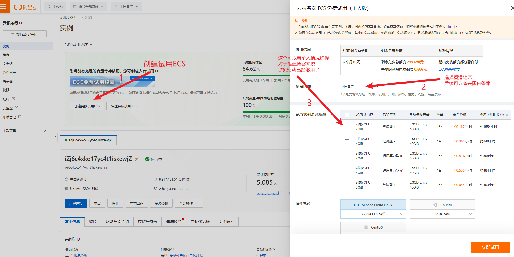

<!-- 管理图片和其他资源
使用这种方法，你可以将文章相关的所有资源都放在同一个文件夹中，便于管理：

src/content/posts/my-complex-post/
├── index.md
├── image1.png
├── image2.jpg
└── data.json
在文章中引用图片时，可以直接使用相对路径：

注意像这样直接填写文件的名字,这样才能让RSS正常构建图片的路径 
-->

<!-- 下面是正文 -->
# 记录一次使用阿里云云服务器ESC搭建个人博客

在这篇文章中，我将分享我使用阿里云云服务器ESC搭建个人博客的完整步骤。

## 选择云服务器
首先，需要有一台云服务器，这里我选择了阿里云的一台2核2G的试用云服务器ESC。当然其他的云服务器大同小异，可以拿来参考。

